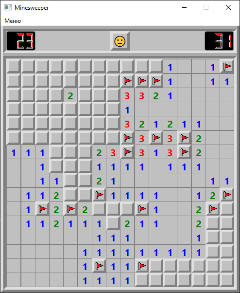

# Minesweeper Classic

Классическая реализация игры "Сапёр" (Minesweeper) на C++ с использованием фреймворка Qt. Проект выполнен в стиле оригинальной игры из Windows с полным функционалом и классическим дизайном.


## Особенности

- **Три уровня сложности**:
  - Новичок: 9×9, 10 мин
  - Любитель: 16×16, 40 мин  
  - Профессионал: 16×30, 99 мин

- **Аутентичный интерфейс**: 
  - Классический серый дизайн
  - Выпуклые и вдавленные кнопки как в оригинале
  - LCD-дисплеи для счётчиков времени и мин
  - Обновляемый эмодзи-статус

- **Полная игровая механика**:
  - ЛКМ для открытия клеток
  - ПКМ для установки/снятия флагов
  - Подсветка возможных мин при нажатии ЛКМ на цифру
  - Установка флагов при 100% вероятности нахождения мин при нажатии ЛКМ на цифру
  - Открытие области без флагов при нажатии ЛКМ на цифру
  - Автоматическое открытие соседних пустых клеток при открытии пустой клетки
  - Генерация поля с гарантией первого безопасного хода
  - Таймер до 999 секунд

- **Визуальная обратная связь**:
  - Разные цвета для цифр
  - Подсветка нажатий
  - Отображение неправильных флагов и всех мин при проигрыше

## Технологии

- **Язык**: C++17
- **Фреймворк**: Qt5 (Widgets)
- **Стиль кода**: ООП, RAII
- **Архитектура**: MVC (Model-View-Controller)
- **Сборка**: CMake

## Требования

- Qt 5.15 или выше
- Компилятор с поддержкой C++17
- CMake 3.16+ (опционально)

## Установка и запуск (Linux/Windows)

### Сборка с помощью CMake
```
mkdir build && cd build
cmake ..
cmake --build .
```
### Запуск
```
./minesweeper
```

## Видео геймплея

https://github.com/user-attachments/assets/9af436ea-0377-4f4b-99dd-29a922b88f71

